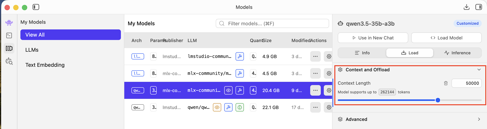

# Setup Guide: Preparing Your Backend for Benchmarking

The benchmark scenarios need enough context window to fit the full conversation history. If your context window is too small, the model will truncate input or refuse to generate, producing skewed or empty results.

**Set your context window to at least 16K tokens** before running the benchmark.

## Minimum context per scenario

| Scenario | Max context (tokens) | + output buffer | Minimum needed |
|---|---:|---:|---:|
| prefill-test | ~8,500 | 150 | **~9,000** |
| doc-summary | ~6,000 | 150 | **~6,500** |
| ops-agent | ~4,500 | 500 | **~5,500** |
| creative-writing | ~60 | 2,000 | **~2,500** |

The prefill-test scenario is the most demanding — its 4th turn sends ~8,500 tokens of context to test how prefill scales. If you only want to run a single scenario with lower requirements, use `--scenario scenarios/creative-writing.json`.

## Symptoms of insufficient context

- Turns producing very short or empty output
- Errors mid-benchmark (model refuses to generate)
- Wildly inconsistent results between turns
- Generation speed looks normal but effective tok/s is near zero

---

## Ollama

### Check context size

```bash
ollama show <model>
```

Look for `context_length` in the model details. Ollama auto-sizes context based on available memory, so it's usually fine out of the box.

### Set context size

If you need to increase it, create a Modelfile:

```
FROM qwen3.5:35b-a3b
PARAMETER num_ctx 16384
```

Then create and use the custom model:

```bash
ollama create qwen3.5-16k -f Modelfile
python3 bench.py --model qwen3.5-16k
```

Alternatively, Ollama respects `num_ctx` in API requests. The benchmark doesn't currently pass this, but Ollama's auto-sizing usually picks a large enough value.

<!-- TODO: screenshot of `ollama show` output -->

---

## LM Studio

### Check context size

Open the model settings in the LM Studio UI. The context length is shown in the model's configuration panel.

### Set context size

1. Open LM Studio
2. Select the loaded model
3. Go to the model settings (gear icon)
4. Set **Context Length** to at least **16384**
5. Restart the server if it was already running



---

## oMLX

### Check context size

Open the admin panel (default: `http://localhost:8000/admin`). Go to **Settings** -> **Generation Defaults**. Look for:

- **Max Context Window** — reject prompts exceeding this token limit
- **Max Tokens** — maximum output tokens per request

### Set context size

1. Open the oMLX admin panel
2. Go to **Settings** -> **Generation Defaults**
3. Set **Max Context Window** to at least **16384**
4. Set **Max Tokens** to at least **2000** (the creative-writing scenario needs this)

<!-- TODO: screenshot of oMLX admin panel showing generation defaults -->

---

## llama-server (raw llama.cpp)

### Check context size

The context size is set at startup via the `-c` flag. Check how the server was launched.

### Set context size

Start (or restart) the server with a sufficient context size:

```bash
llama-server -m model.gguf -c 16384 --port 8090
```

The `-c` flag sets the maximum context length in tokens.

---

## Disabling thinking for Qwen3.5

Qwen3.5 models default to thinking enabled, which adds significant latency and distorts benchmark results. The `/no_think` soft switch that worked for Qwen3 has been removed in Qwen3.5.

### Ollama

Ollama handles this automatically — the benchmark sends `"think": false` via the native API.

### LM Studio / oMLX

For LM Studio and oMLX, you need to patch the model's chat template. The benchmark has a `--no-think` flag that does this automatically:

```bash
python3 bench.py --backend lmstudio --model mlx-community/qwen3.5-35b-a3b --no-think
```

This backs up the template, disables thinking, runs the benchmark, and always restores the original — even on errors or Ctrl+C.

There's also a standalone toggle script:

```bash
# Check current state
python3 scripts/qwen3.5-35b-a3b-toggle-thinking.py status

# Disable thinking
python3 scripts/qwen3.5-35b-a3b-toggle-thinking.py off

# Verify via API
python3 scripts/qwen3.5-35b-a3b-toggle-thinking.py verify
```

See [scripts/README.md](../scripts/README.md) for details on how the template patch works and why `/no_think` doesn't work for Qwen3.5.

---

## Step-by-step: running your first benchmark

1. **Start your backend** (Ollama, LM Studio, oMLX, or llama-server)
2. **Load a model** and verify it's running:
   ```bash
   # Ollama (default port 11434)
   curl http://localhost:11434/api/tags

   # LM Studio (default port 1234)
   curl http://localhost:1234/v1/models

   # oMLX (default port 8000)
   curl -H "Authorization: Bearer your-key" http://localhost:8000/v1/models

   # llama-server (default port 8090)
   curl http://localhost:8090/v1/models
   ```
3. **Check your context window** is at least 16K (see backend-specific instructions above)
4. **Run the benchmark** (pick your backend):

   **Ollama:**
   ```bash
   python3 bench.py --model qwen3.5:35b-a3b
   ```

   **LM Studio:**
   ```bash
   # Add --no-think for Qwen3.5 to disable thinking mode
   python3 bench.py --backend lmstudio --model mlx-community/qwen3.5-35b-a3b --no-think
   ```

   **oMLX:**
   ```bash
   OPENAI_API_KEY=your-key python3 bench.py --backend openai --backend-label omlx \
     --base-url http://localhost:8000 --model "Qwen3.5-35B-A3B-4bit" --label "oMLX MLX" --no-think
   ```

   **llama-server (raw llama.cpp):**
   ```bash
   python3 bench.py --backend llama-server --base-url http://localhost:8090 \
     --model qwen3.5:35b-a3b --label "llama-server"
   ```

   **MiniMax (cloud):**
   ```bash
   export MINIMAX_API_KEY=your-key-here
   python3 bench.py --backend minimax --model MiniMax-M2.5
   ```

5. **Check the results** — if you see empty turns or errors, check context size and thinking mode
6. **Compare** against other backends or hardware:
   ```bash
   python3 compare.py results/<model>/<scenario>/*.json
   ```
